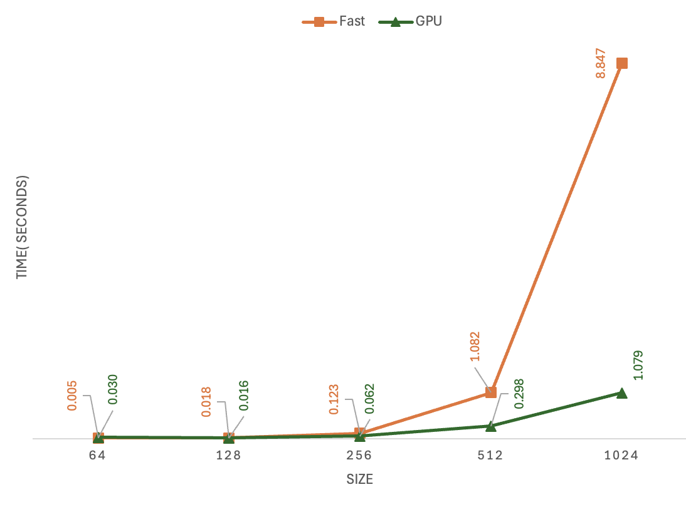

## Nana Takada, nt388
# 3.1, 3.2 Diagnostics output

````
MAP
 
================================================================================
 Parallel Accelerator Optimizing:  Function tensor_map.<locals>._map, 
/Users/takadanana/Desktop/mle/mod3-eigenValue7/minitorch/fast_ops.py (163)  
================================================================================


Parallel loop listing for  Function tensor_map.<locals>._map, /Users/takadanana/Desktop/mle/mod3-eigenValue7/minitorch/fast_ops.py (163) 
-------------------------------------------------------------------------------------------------------------------------------------------------|loop #ID
    def _map(                                                                                                                                    | 
        out: Storage,                                                                                                                            | 
        out_shape: Shape,                                                                                                                        | 
        out_strides: Strides,                                                                                                                    | 
        in_storage: Storage,                                                                                                                     | 
        in_shape: Shape,                                                                                                                         | 
        in_strides: Strides,                                                                                                                     | 
    ) -> None:                                                                                                                                   | 
        """                                                                                                                                      | 
        Applies a function to each element of a tensor.                                                                                          | 
                                                                                                                                                 | 
        This function maps a function `fn` to each element of the input tensor `in_storage` and stores the result in the output tensor `out`.    | 
                                                                                                                                                 | 
        Args:                                                                                                                                    | 
        ----                                                                                                                                     | 
            out (Storage): The output tensor where the result of the mapping will be stored.                                                     | 
            out_shape (Shape): The shape of the output tensor.                                                                                   | 
            out_strides (Strides): The strides of the output tensor.                                                                             | 
            in_storage (Storage): The input tensor to be mapped.                                                                                 | 
            in_shape (Shape): The shape of the input tensor.                                                                                     | 
            in_strides (Strides): The strides of the input tensor.                                                                               | 
        """                                                                                                                                      | 
        # TODO: Implement for Task 3.1.                                                                                                          | 
        #raise NotImplementedError("Need to implement for Task 3.1")                                                                             | 
                                                                                                                                                 | 
        identical = np.array_equal(in_strides, out_strides)                                                                                      | 
                                                                                                                                                 | 
        for i in prange(len(out)): --------------------------------------------------------------------------------------------------------------| #2
            if identical:                                                                                                                        | 
                out[i] = fn(in_storage[i])                                                                                                       | 
                                                                                                                                                 | 
            else:                                                                                                                                | 
                out_index = np.zeros(MAX_DIMS, np.int16)-----------------------------------------------------------------------------------------| #0
                in_index = np.zeros(MAX_DIMS, np.int16)------------------------------------------------------------------------------------------| #1
                to_index(i, out_shape, out_index)                                                                                                | 
                broadcast_index(out_index, out_shape, in_shape, in_index)                                                                        | 
                o = index_to_position(out_index, out_strides)                                                                                    | 
                j = index_to_position(in_index, in_strides)                                                                                      | 
                out[o] = fn(in_storage[j])                                                                                                       | 
--------------------------------- Fusing loops ---------------------------------
Attempting fusion of parallel loops (combines loops with similar properties)...
Following the attempted fusion of parallel for-loops there are 1 parallel for-
loop(s) (originating from loops labelled: #2).
--------------------------------------------------------------------------------
---------------------------- Optimising loop nests -----------------------------
Attempting loop nest rewrites (optimising for the largest parallel loops)...
 
+--2 is a parallel loop
   +--0 --> rewritten as a serial loop
   +--1 --> rewritten as a serial loop
--------------------------------------------------------------------------------
----------------------------- Before Optimisation ------------------------------
Parallel region 0:
+--2 (parallel)
   +--0 (parallel)
   +--1 (parallel)


--------------------------------------------------------------------------------
------------------------------ After Optimisation ------------------------------
Parallel region 0:
+--2 (parallel)
   +--0 (serial)
   +--1 (serial)


 
Parallel region 0 (loop #2) had 0 loop(s) fused and 2 loop(s) serialized as part
 of the larger parallel loop (#2).
--------------------------------------------------------------------------------
--------------------------------------------------------------------------------
 
---------------------------Loop invariant code motion---------------------------
Allocation hoisting:
The memory allocation derived from the instruction at 
/Users/takadanana/Desktop/mle/mod3-eigenValue7/minitorch/fast_ops.py (195) is 
hoisted out of the parallel loop labelled #2 (it will be performed before the 
loop is executed and reused inside the loop):
   Allocation:: out_index = np.zeros(MAX_DIMS, np.int16)
    - numpy.empty() is used for the allocation.
The memory allocation derived from the instruction at 
/Users/takadanana/Desktop/mle/mod3-eigenValue7/minitorch/fast_ops.py (196) is 
hoisted out of the parallel loop labelled #2 (it will be performed before the 
loop is executed and reused inside the loop):
   Allocation:: in_index = np.zeros(MAX_DIMS, np.int16)
    - numpy.empty() is used for the allocation.
None
ZIP
 
================================================================================
 Parallel Accelerator Optimizing:  Function tensor_zip.<locals>._zip, 
/Users/takadanana/Desktop/mle/mod3-eigenValue7/minitorch/fast_ops.py (229)  
================================================================================


Parallel loop listing for  Function tensor_zip.<locals>._zip, /Users/takadanana/Desktop/mle/mod3-eigenValue7/minitorch/fast_ops.py (229) 
---------------------------------------------------------------------------------------------------------------------------------------------------------------------------------------------------------------------------------------------------------------------------|loop #ID
    def _zip(                                                                                                                                                                                                                                                              | 
        out: Storage,                                                                                                                                                                                                                                                      | 
        out_shape: Shape,                                                                                                                                                                                                                                                  | 
        out_strides: Strides,                                                                                                                                                                                                                                              | 
        a_storage: Storage,                                                                                                                                                                                                                                                | 
        a_shape: Shape,                                                                                                                                                                                                                                                    | 
        a_strides: Strides,                                                                                                                                                                                                                                                | 
        b_storage: Storage,                                                                                                                                                                                                                                                | 
        b_shape: Shape,                                                                                                                                                                                                                                                    | 
        b_strides: Strides,                                                                                                                                                                                                                                                | 
    ) -> None:                                                                                                                                                                                                                                                             | 
        """                                                                                                                                                                                                                                                                | 
        Performs element-wise operations on two tensors and stores the result in a out tensor.                                                                                                                                                                             | 
                                                                                                                                                                                                                                                                           | 
        This function applies a fn to each pair of elements from two input tensors `a_storage` and `b_storage`, and stores the result in the output tensor `out`. The operation is specified by the function `fn`, which takes two floats as input and returns a float.    | 
                                                                                                                                                                                                                                                                           | 
        Args:                                                                                                                                                                                                                                                              | 
        ----                                                                                                                                                                                                                                                               | 
            out (Storage): The output tensor where the result will be stored.                                                                                                                                                                                              | 
            out_shape (Shape): The shape of the output tensor.                                                                                                                                                                                                             | 
            out_strides (Strides): The strides of the output tensor.                                                                                                                                                                                                       | 
            a_storage (Storage): The first input tensor.                                                                                                                                                                                                                   | 
            a_shape (Shape): The shape of the first input tensor.                                                                                                                                                                                                          | 
            a_strides (Strides): The strides of the first input tensor.                                                                                                                                                                                                    | 
            b_storage (Storage): The second input tensor.                                                                                                                                                                                                                  | 
            b_shape (Shape): The shape of the second input tensor.                                                                                                                                                                                                         | 
            b_strides (Strides): The strides of the second input tensor.                                                                                                                                                                                                   | 
        """                                                                                                                                                                                                                                                                | 
        # TODO: Implement for Task 3.1.                                                                                                                                                                                                                                    | 
        # raise NotImplementedError("Need to implement for Task 3.1")                                                                                                                                                                                                      | 
        identical = np.array_equal(a_strides, out_strides) and np.array_equal(b_strides, out_strides)                                                                                                                                                                      | 
        identical = identical and np.array_equal(a_shape, b_shape)                                                                                                                                                                                                         | 
                                                                                                                                                                                                                                                                           | 
        for i in prange(len(out)):-----------------------------------------------------------------------------------------------------------------------------------------------------------------------------------------------------------------------------------------| #6
            if identical:                                                                                                                                                                                                                                                  | 
                out[i] = fn(a_storage[i], b_storage[i])                                                                                                                                                                                                                    | 
            else:                                                                                                                                                                                                                                                          | 
                out_index = np.zeros(MAX_DIMS, np.int32)-------------------------------------------------------------------------------------------------------------------------------------------------------------------------------------------------------------------| #3
                a_index = np.zeros(MAX_DIMS, np.int32)---------------------------------------------------------------------------------------------------------------------------------------------------------------------------------------------------------------------| #4
                b_index = np.zeros(MAX_DIMS, np.int32)---------------------------------------------------------------------------------------------------------------------------------------------------------------------------------------------------------------------| #5
                to_index(i, out_shape, out_index)                                                                                                                                                                                                                          | 
                o = index_to_position(out_index, out_strides)                                                                                                                                                                                                              | 
                broadcast_index(out_index, out_shape, a_shape, a_index)                                                                                                                                                                                                    | 
                j = index_to_position(a_index, a_strides)                                                                                                                                                                                                                  | 
                broadcast_index(out_index, out_shape, b_shape, b_index)                                                                                                                                                                                                    | 
                k = index_to_position(b_index, b_strides)                                                                                                                                                                                                                  | 
                out[o] = fn(a_storage[j], b_storage[k])                                                                                                                                                                                                                    | 
--------------------------------- Fusing loops ---------------------------------
Attempting fusion of parallel loops (combines loops with similar properties)...
Following the attempted fusion of parallel for-loops there are 1 parallel for-
loop(s) (originating from loops labelled: #6).
--------------------------------------------------------------------------------
---------------------------- Optimising loop nests -----------------------------
Attempting loop nest rewrites (optimising for the largest parallel loops)...
 
+--6 is a parallel loop
   +--3 --> rewritten as a serial loop
   +--4 --> rewritten as a serial loop
   +--5 --> rewritten as a serial loop
--------------------------------------------------------------------------------
----------------------------- Before Optimisation ------------------------------
Parallel region 0:
+--6 (parallel)
   +--3 (parallel)
   +--4 (parallel)
   +--5 (parallel)


--------------------------------------------------------------------------------
------------------------------ After Optimisation ------------------------------
Parallel region 0:
+--6 (parallel)
   +--3 (serial)
   +--4 (serial)
   +--5 (serial)


 
Parallel region 0 (loop #6) had 0 loop(s) fused and 3 loop(s) serialized as part
 of the larger parallel loop (#6).
--------------------------------------------------------------------------------
--------------------------------------------------------------------------------
 
---------------------------Loop invariant code motion---------------------------
Allocation hoisting:
The memory allocation derived from the instruction at 
/Users/takadanana/Desktop/mle/mod3-eigenValue7/minitorch/fast_ops.py (266) is 
hoisted out of the parallel loop labelled #6 (it will be performed before the 
loop is executed and reused inside the loop):
   Allocation:: out_index = np.zeros(MAX_DIMS, np.int32)
    - numpy.empty() is used for the allocation.
The memory allocation derived from the instruction at 
/Users/takadanana/Desktop/mle/mod3-eigenValue7/minitorch/fast_ops.py (267) is 
hoisted out of the parallel loop labelled #6 (it will be performed before the 
loop is executed and reused inside the loop):
   Allocation:: a_index = np.zeros(MAX_DIMS, np.int32)
    - numpy.empty() is used for the allocation.
The memory allocation derived from the instruction at 
/Users/takadanana/Desktop/mle/mod3-eigenValue7/minitorch/fast_ops.py (268) is 
hoisted out of the parallel loop labelled #6 (it will be performed before the 
loop is executed and reused inside the loop):
   Allocation:: b_index = np.zeros(MAX_DIMS, np.int32)
    - numpy.empty() is used for the allocation.
None
REDUCE
 
================================================================================
 Parallel Accelerator Optimizing:  Function tensor_reduce.<locals>._reduce, 
/Users/takadanana/Desktop/mle/mod3-eigenValue7/minitorch/fast_ops.py (301)  
================================================================================


Parallel loop listing for  Function tensor_reduce.<locals>._reduce, /Users/takadanana/Desktop/mle/mod3-eigenValue7/minitorch/fast_ops.py (301) 
---------------------------------------------------------------------------------------------------------------------------------------------------------------------------------------|loop #ID
    def _reduce(                                                                                                                                                                       | 
        out: Storage,                                                                                                                                                                  | 
        out_shape: Shape,                                                                                                                                                              | 
        out_strides: Strides,                                                                                                                                                          | 
        a_storage: Storage,                                                                                                                                                            | 
        a_shape: Shape,                                                                                                                                                                | 
        a_strides: Strides,                                                                                                                                                            | 
        reduce_dim: int,                                                                                                                                                               | 
    ) -> None:                                                                                                                                                                         | 
        """                                                                                                                                                                            | 
        Performs tensor reduction operation along a specified dimension.                                                                                                               | 
                                                                                                                                                                                       | 
        This function applies a reduction operation to the input tensor `a_storage` along the dimension specified by `reduce_dim`. The result is stored in the output tensor `out`.    | 
                                                                                                                                                                                       | 
        Args:                                                                                                                                                                          | 
        ----                                                                                                                                                                           | 
            out (Storage): The output tensor where the reduction result will be stored.                                                                                                | 
            out_shape (Shape): The shape of the output tensor.                                                                                                                         | 
            out_strides (Strides): The strides of the output tensor.                                                                                                                   | 
            a_storage (Storage): The input tensor to be reduced.                                                                                                                       | 
            a_shape (Shape): The shape of the input tensor.                                                                                                                            | 
            a_strides (Strides): The strides of the input tensor.                                                                                                                      | 
            reduce_dim (int): The dimension along which the reduction operation is performed.                                                                                          | 
                                                                                                                                                                                       | 
        """                                                                                                                                                                            | 
        # TODO: Implement for Task 3.1.                                                                                                                                                | 
        #  raise NotImplementedError("Need to implement for Task 3.1")                                                                                                                 | 
                                                                                                                                                                                       | 
                                                                                                                                                                                       | 
        reduce_size = a_shape[reduce_dim]                                                                                                                                              | 
                                                                                                                                                                                       | 
        for i in prange(len(out)):-----------------------------------------------------------------------------------------------------------------------------------------------------| #9
            out_index: Index = np.zeros(MAX_DIMS, np.int32)----------------------------------------------------------------------------------------------------------------------------| #7
            to_index(i, out_shape, out_index)                                                                                                                                          | 
            o = index_to_position(out_index, out_strides)                                                                                                                              | 
            for s in prange(reduce_size):----------------------------------------------------------------------------------------------------------------------------------------------| #8
                out_index[reduce_dim] = s                                                                                                                                              | 
                j = index_to_position(out_index, a_strides)                                                                                                                            | 
                out[o] = fn(out[o], a_storage[j])                                                                                                                                      | 
--------------------------------- Fusing loops ---------------------------------
Attempting fusion of parallel loops (combines loops with similar properties)...
Following the attempted fusion of parallel for-loops there are 2 parallel for-
loop(s) (originating from loops labelled: #9, #7).
--------------------------------------------------------------------------------
---------------------------- Optimising loop nests -----------------------------
Attempting loop nest rewrites (optimising for the largest parallel loops)...
 
+--9 is a parallel loop
   +--8 --> rewritten as a serial loop
   +--7 --> rewritten as a serial loop
--------------------------------------------------------------------------------
----------------------------- Before Optimisation ------------------------------
Parallel region 0:
+--9 (parallel)
   +--8 (parallel)
   +--7 (parallel)


--------------------------------------------------------------------------------
------------------------------ After Optimisation ------------------------------
Parallel region 0:
+--9 (parallel)
   +--8 (serial)
   +--7 (serial)


 
Parallel region 0 (loop #9) had 0 loop(s) fused and 2 loop(s) serialized as part
 of the larger parallel loop (#9).
--------------------------------------------------------------------------------
--------------------------------------------------------------------------------
 
---------------------------Loop invariant code motion---------------------------
Allocation hoisting:
The memory allocation derived from the instruction at 
/Users/takadanana/Desktop/mle/mod3-eigenValue7/minitorch/fast_ops.py (333) is 
hoisted out of the parallel loop labelled #9 (it will be performed before the 
loop is executed and reused inside the loop):
   Allocation:: out_index: Index = np.zeros(MAX_DIMS, np.int32)
    - numpy.empty() is used for the allocation.
None
MATRIX MULTIPLY
 
================================================================================
 Parallel Accelerator Optimizing:  Function _tensor_matrix_multiply, 
/Users/takadanana/Desktop/mle/mod3-eigenValue7/minitorch/fast_ops.py (345)  
================================================================================


Parallel loop listing for  Function _tensor_matrix_multiply, /Users/takadanana/Desktop/mle/mod3-eigenValue7/minitorch/fast_ops.py (345) 
---------------------------------------------------------------------------------------------|loop #ID
def _tensor_matrix_multiply(                                                                 | 
    out: Storage,                                                                            | 
    out_shape: Shape,                                                                        | 
    out_strides: Strides,                                                                    | 
    a_storage: Storage,                                                                      | 
    a_shape: Shape,                                                                          | 
    a_strides: Strides,                                                                      | 
    b_storage: Storage,                                                                      | 
    b_shape: Shape,                                                                          | 
    b_strides: Strides,                                                                      | 
) -> None:                                                                                   | 
    """NUMBA tensor matrix multiply function.                                                | 
                                                                                             | 
    Should work for any tensor shapes that broadcast as long as                              | 
                                                                                             | 
    ```                                                                                      | 
    assert a_shape[-1] == b_shape[-2]                                                        | 
    ```                                                                                      | 
                                                                                             | 
    Optimizations:                                                                           | 
                                                                                             | 
    * Outer loop in parallel                                                                 | 
    * No index buffers or function calls                                                     | 
    * Inner loop should have no global writes, 1 multiply.                                   | 
                                                                                             | 
                                                                                             | 
    Args:                                                                                    | 
    ----                                                                                     | 
        out (Storage): storage for `out` tensor                                              | 
        out_shape (Shape): shape for `out` tensor                                            | 
        out_strides (Strides): strides for `out` tensor                                      | 
        a_storage (Storage): storage for `a` tensor                                          | 
        a_shape (Shape): shape for `a` tensor                                                | 
        a_strides (Strides): strides for `a` tensor                                          | 
        b_storage (Storage): storage for `b` tensor                                          | 
        b_shape (Shape): shape for `b` tensor                                                | 
        b_strides (Strides): strides for `b` tensor                                          | 
                                                                                             | 
    Returns:                                                                                 | 
    -------                                                                                  | 
        None : Fills in `out`                                                                | 
                                                                                             | 
    """                                                                                      | 
    a_batch_stride = a_strides[0] if a_shape[0] > 1 else 0                                   | 
    b_batch_stride = b_strides[0] if b_shape[0] > 1 else 0                                   | 
                                                                                             | 
    # TODO: Implement for Task 3.2.                                                          | 
    #raise NotImplementedError("Need to implement for Task 3.2")                             | 
    assert a_shape[-1] == b_shape[-2], "inner dim has to be same"                            | 
                                                                                             | 
    for n in prange(out_shape[0]):-----------------------------------------------------------| #10
        for i in range(out_shape[1]):  # Rows of a                                           | 
            for j in range(out_shape[2]):  # Columns of b                                    | 
                sum_result = 0                                                               | 
                a_pos = n * a_batch_stride + i * a_strides[1]                                | 
                b_pos = n * b_batch_stride + j * b_strides[2]                                | 
                                                                                             | 
                for _ in range(a_shape[-1]):  # Columns of a and rows of b                   | 
                    sum_result += a_storage[a_pos] * b_storage[b_pos]                        | 
                    a_pos += a_strides[2]                                                    | 
                    b_pos += b_strides[1]                                                    | 
                                                                                             | 
                out_pos = n * out_strides[0] + i * out_strides[1] + j*out_strides[2] # Ba    | 
                out[out_pos] = sum_result                                                    | 
--------------------------------- Fusing loops ---------------------------------
Attempting fusion of parallel loops (combines loops with similar properties)...
Following the attempted fusion of parallel for-loops there are 1 parallel for-
loop(s) (originating from loops labelled: #10).
--------------------------------------------------------------------------------
----------------------------- Before Optimisation ------------------------------
--------------------------------------------------------------------------------
------------------------------ After Optimisation ------------------------------
Parallel structure is already optimal.
--------------------------------------------------------------------------------
--------------------------------------------------------------------------------
 
---------------------------Loop invariant code motion---------------------------
Allocation hoisting:
No allocation hoisting found
None

````

# 3.4

# 3.5
### Simple, 100 Hidden
- Epoch  0  loss  5.383634132899742 correct 36 time per epoch 4.2239 sec
- Epoch  10  loss  1.1688674698463364 correct 47 time per epoch 0.0536 sec
- Epoch  20  loss  1.3960152873143887 correct 49 time per epoch 0.0489 sec
- Epoch  30  loss  1.4394661537967046 correct 50 time per epoch 0.0477 sec
- Epoch  40  loss  0.9213588562331029 correct 50 time per epoch 0.0481 sec
- Epoch  50  loss  0.6341209554155339 correct 49 time per epoch 0.0511 sec
- Epoch  60  loss  0.19530216434265713 correct 50 time per epoch 0.0480 sec
- Epoch  70  loss  0.3438551323862292 correct 50 time per epoch 0.0476 sec
- Epoch  80  loss  0.6500006431337246 correct 50 time per epoch 0.0478 sec
- Epoch  90  loss  0.1958860009546074 correct 50 time per epoch 0.0477 sec
- Epoch  100  loss  0.22285860088335033 correct 50 time per epoch 0.0471 sec
- Epoch  110  loss  0.7593623324607923 correct 50 time per epoch 0.0474 sec
- Epoch  120  loss  0.21256087246685057 correct 50 time per epoch 0.0483 sec
- Epoch  130  loss  0.47871035708046406 correct 50 time per epoch 0.0480 sec
- Epoch  140  loss  0.2144775426888665 correct 50 time per epoch 0.0476 sec
- Epoch  150  loss  0.03889150448800917 correct 50 time per epoch 0.0475 sec
- Epoch  160  loss  0.12579352764928553 correct 50 time per epoch 0.0475 sec
- Epoch  170  loss  0.24756626736175708 correct 50 time per epoch 0.0476 sec
- Epoch  180  loss  0.41187367868430524 correct 50 time per epoch 0.0478 sec
- Epoch  190  loss  0.0396738511323466 correct 50 time per epoch 0.0479 sec
- Epoch  200  loss  0.04891035698478466 correct 50 time per epoch 0.0471 sec
- Epoch  210  loss  0.390644904997842 correct 50 time per epoch 0.0480 sec
- Epoch  220  loss  0.04017188150026912 correct 50 time per epoch 0.0474 sec
- Epoch  230  loss  0.22326810536256209 correct 50 time per epoch 0.0477 sec
- Epoch  240  loss  0.38864006795828415 correct 50 time per epoch 0.0475 sec
- Epoch  250  loss  0.07079792001052053 correct 50 time per epoch 0.0479 sec
- Epoch  260  loss  0.3651909781967093 correct 50 time per epoch 0.0528 sec
- Epoch  270  loss  0.07186753951412359 correct 50 time per epoch 0.0486 sec
- Epoch  280  loss  0.21719230513932808 correct 50 time per epoch 0.0483 sec
- Epoch  290  loss  0.179584193347992 correct 50 time per epoch 0.0480 sec
- Epoch  300  loss  0.29142577462121205 correct 50 time per epoch 0.0483 sec
- Epoch  310  loss  0.0015985597167556427 correct 50 time per epoch 0.0492 sec
- Epoch  320  loss  0.14942197244914765 correct 50 time per epoch 0.0485 sec
- Epoch  330  loss  0.3711575470135778 correct 50 time per epoch 0.0481 sec
- Epoch  340  loss  0.2385039860722058 correct 50 time per epoch 0.0727 sec
- Epoch  350  loss  0.15691343032385252 correct 50 time per epoch 0.0477 sec
- Epoch  360  loss  0.048272800025456905 correct 50 time per epoch 0.0490 sec
- Epoch  370  loss  0.06038886134124147 correct 50 time per epoch 0.0477 sec
- Epoch  380  loss  0.05618376923112069 correct 50 time per epoch 0.0478 sec
- Epoch  390  loss  0.008521827631572292 correct 50 time per epoch 0.0476 sec
- Epoch  400  loss  0.09914604951544682 correct 50 time per epoch 0.0479 sec
- Epoch  410  loss  0.38842314862292737 correct 50 time per epoch 0.0486 sec
- Epoch  420  loss  0.04632208669668574 correct 50 time per epoch 0.0486 sec
- Epoch  430  loss  0.17562711038481926 correct 50 time per epoch 0.0491 sec
- Epoch  440  loss  0.00041275843570672324 correct 50 time per epoch 0.0478 sec

## Split, 100 Hidden 
- Epoch  0  loss  8.008871366159063 correct 29 time per epoch 4.7189 sec
- Epoch  10  loss  3.7584094429295023 correct 35 time per epoch 0.0483 sec
- Epoch  20  loss  5.728938168155207 correct 38 time per epoch 0.0491 sec
- Epoch  30  loss  2.9685963480273014 correct 44 time per epoch 0.0485 sec
- Epoch  40  loss  4.801543007534216 correct 45 time per epoch 0.0481 sec
- Epoch  50  loss  3.474929416816451 correct 44 time per epoch 0.0489 sec
- Epoch  60  loss  2.184912833767382 correct 47 time per epoch 0.0485 sec
- Epoch  70  loss  4.289341848771563 correct 46 time per epoch 0.0480 sec
- Epoch  80  loss  2.4208355213540056 correct 47 time per epoch 0.0482 sec
- Epoch  90  loss  1.0856207389430597 correct 49 time per epoch 0.0480 sec
- Epoch  100  loss  1.7675511204449819 correct 48 time per epoch 0.0480 sec
- Epoch  110  loss  1.4105233596660374 correct 49 time per epoch 0.0492 sec
- Epoch  120  loss  2.4966454785975962 correct 49 time per epoch 0.0482 sec
- Epoch  130  loss  1.8919846728922618 correct 49 time per epoch 0.0481 sec
- Epoch  140  loss  2.1260700982814806 correct 47 time per epoch 0.0485 sec
- Epoch  150  loss  0.709279488378404 correct 49 time per epoch 0.0485 sec
- Epoch  160  loss  0.6628764591414 correct 48 time per epoch 0.0816 sec
- Epoch  170  loss  1.4426927530282463 correct 48 time per epoch 0.0481 sec
- Epoch  180  loss  0.9712438153266284 correct 49 time per epoch 0.0485 sec
- Epoch  190  loss  0.9658024096458364 correct 49 time per epoch 0.0480 sec
- Epoch  200  loss  4.277438184240447 correct 42 time per epoch 0.0486 sec
- Epoch  210  loss  0.9486920193664594 correct 49 time per epoch 0.0489 sec
- Epoch  220  loss  1.1759368860802368 correct 49 time per epoch 0.0492 sec
- Epoch  230  loss  0.9959802672023926 correct 50 time per epoch 0.0484 sec
- Epoch  240  loss  1.6195636800314224 correct 48 time per epoch 0.0485 sec
- Epoch  250  loss  2.1760979514799197 correct 48 time per epoch 0.0489 sec
- Epoch  260  loss  0.46541808405482393 correct 50 time per epoch 0.0487 sec
- Epoch  270  loss  2.7923685340380326 correct 46 time per epoch 0.0480 sec
- Epoch  280  loss  0.841958629848482 correct 50 time per epoch 0.0485 sec
- Epoch  290  loss  0.9741724470854315 correct 49 time per epoch 0.0487 sec
- Epoch  300  loss  2.810910861205393 correct 49 time per epoch 0.0479 sec
- Epoch  310  loss  0.20605593172987055 correct 50 time per epoch 0.0477 sec
- Epoch  320  loss  0.7690463886843698 correct 50 time per epoch 0.0476 sec
- Epoch  330  loss  0.6580144567738511 correct 49 time per epoch 0.0482 sec
- Epoch  340  loss  0.5633920223449072 correct 49 time per epoch 0.0480 sec
- Epoch  350  loss  1.1458282265615722 correct 49 time per epoch 0.0479 sec
- Epoch  360  loss  1.087391277112947 correct 49 time per epoch 0.0478 sec
- Epoch  370  loss  0.3158601355404176 correct 49 time per epoch 0.0475 sec
- Epoch  380  loss  0.3136356198934094 correct 50 time per epoch 0.0481 sec
- Epoch  390  loss  0.2178142560617884 correct 48 time per epoch 0.0479 sec
- Epoch  400  loss  1.4903817499091858 correct 50 time per epoch 0.0477 sec
- Epoch  410  loss  0.9769892228272659 correct 49 time per epoch 0.0480 sec
- Epoch  420  loss  0.24606345693897427 correct 49 time per epoch 0.0476 sec
- Epoch  430  loss  0.3566123894965359 correct 49 time per epoch 0.0484 sec
- Epoch  440  loss  3.0501386136461472 correct 45 time per epoch 0.0473 sec
- Epoch  450  loss  0.4264276580929433 correct 49 time per epoch 0.0479 sec
- Epoch  460  loss  0.8595809948095969 correct 49 time per epoch 0.0486 sec
- Epoch  470  loss  0.6999157731589896 correct 48 time per epoch 0.0483 sec
- Epoch  480  loss  0.15083755074978394 correct 50 time per epoch 0.0484 sec
- Epoch  490  loss  1.7821512694690962 correct 49 time per epoch 0.0480 sec

 ## xor, 100 Hidden 
- Epoch  0  loss  6.7373593421554325 correct 30 time per epoch 4.0988 sec
- Epoch  10  loss  5.178838405556748 correct 41 time per epoch 0.0510 sec
- Epoch  20  loss  4.072772840364853 correct 45 time per epoch 0.0487 sec
- Epoch  30  loss  2.9174662336646238 correct 45 time per epoch 0.0484 sec
- Epoch  40  loss  3.8814908134414554 correct 47 time per epoch 0.0478 sec
- Epoch  50  loss  2.1005611029665823 correct 47 time per epoch 0.0481 sec
- Epoch  60  loss  1.7312426732890174 correct 47 time per epoch 0.0483 sec
- Epoch  70  loss  1.8157700383852362 correct 47 time per epoch 0.0480 sec
- Epoch  80  loss  2.155469322750036 correct 48 time per epoch 0.0484 sec
- Epoch  90  loss  2.8536399400097694 correct 49 time per epoch 0.0482 sec
- Epoch  100  loss  2.7956265608965847 correct 48 time per epoch 0.0482 sec
- Epoch  110  loss  1.8469072373694766 correct 48 time per epoch 0.0536 sec
- Epoch  120  loss  1.5340744618049953 correct 49 time per epoch 0.0483 sec
- Epoch  130  loss  1.338627324721342 correct 48 time per epoch 0.0481 sec
- Epoch  140  loss  1.5270924070374001 correct 49 time per epoch 0.0506 sec
- Epoch  150  loss  1.9048189216759686 correct 49 time per epoch 0.0499 sec
- Epoch  160  loss  0.8537510748821208 correct 49 time per epoch 0.0479 sec
- Epoch  170  loss  0.7866725072918682 correct 49 time per epoch 0.0496 sec
- Epoch  180  loss  1.4989009444761376 correct 49 time per epoch 0.0483 sec
- Epoch  190  loss  1.5822540699254146 correct 49 time per epoch 0.0767 sec
- Epoch  200  loss  0.6311302784640471 correct 49 time per epoch 0.0478 sec
- Epoch  210  loss  1.106889157073104 correct 49 time per epoch 0.0487 sec
- Epoch  220  loss  0.5751339941584248 correct 50 time per epoch 0.0492 sec
- Epoch  230  loss  0.6506767493094007 correct 49 time per epoch 0.0491 sec
- Epoch  240  loss  1.0189278629649814 correct 49 time per epoch 0.0481 sec
- Epoch  250  loss  0.5741153615650701 correct 50 time per epoch 0.0480 sec
- Epoch  260  loss  1.536217983406659 correct 50 time per epoch 0.0484 sec
- Epoch  270  loss  0.34916679113437327 correct 50 time per epoch 0.0483 sec
- Epoch  280  loss  0.22051911995461626 correct 50 time per epoch 0.0485 sec
- Epoch  290  loss  0.7814689428657837 correct 50 time per epoch 0.0475 sec
- Epoch  300  loss  0.41282561981476595 correct 49 time per epoch 0.0477 sec
- Epoch  310  loss  0.19460778277400098 correct 50 time per epoch 0.0481 sec
- Epoch  320  loss  0.35922519268550157 correct 50 time per epoch 0.0476 sec
- Epoch  330  loss  0.9826633486675745 correct 50 time per epoch 0.0478 sec
- Epoch  340  loss  0.20001799769334883 correct 50 time per epoch 0.0477 sec
- Epoch  350  loss  0.4992607842073332 correct 49 time per epoch 0.0476 sec
- Epoch  360  loss  0.9313337032358764 correct 50 time per epoch 0.0480 sec
- Epoch  370  loss  0.19736565789755425 correct 50 time per epoch 0.0483 sec
- Epoch  380  loss  0.854969325162099 correct 50 time per epoch 0.0484 sec
- Epoch  390  loss  0.1651566261501391 correct 50 time per epoch 0.0479 sec
- Epoch  400  loss  0.3669346472015093 correct 50 time per epoch 0.0480 sec
- Epoch  410  loss  0.15702764778011125 correct 50 time per epoch 0.0481 sec
- Epoch  420  loss  0.6103421800750798 correct 50 time per epoch 0.0477 sec
- Epoch  430  loss  0.1189425791105268 correct 50 time per epoch 0.0479 sec
- Epoch  440  loss  0.04337859192258562 correct 50 time per epoch 0.0489 sec
- Epoch  450  loss  0.210744361682833 correct 50 time per epoch 0.0481 sec
- Epoch  460  loss  0.0991369219588564 correct 50 time per epoch 0.0474 sec
- Epoch  470  loss  0.18177562456369914 correct 50 time per epoch 0.0504 sec
- Epoch  480  loss  0.10822903620164233 correct 50 time per epoch 0.0483 sec
- Epoch  490  loss  0.06745687488024991 correct 50 time per epoch 0.0482 sec

## Simple, 200 Hidden 
- Epoch  0  loss  11.323509466241854 correct 24 time per epoch 4.1759 sec
- Epoch  10  loss  2.47933972305018 correct 45 time per epoch 0.0884 sec
- Epoch  20  loss  1.9708465654784186 correct 47 time per epoch 0.0887 sec
- Epoch  30  loss  1.8954283912446874 correct 48 time per epoch 0.0870 sec
- Epoch  40  loss  0.5345001859771913 correct 50 time per epoch 0.0880 sec
- Epoch  50  loss  0.6473644837417608 correct 50 time per epoch 0.0891 sec
- Epoch  60  loss  1.949783826056388 correct 46 time per epoch 0.0863 sec
- Epoch  70  loss  0.9861968710089104 correct 50 time per epoch 0.0878 sec
- Epoch  80  loss  0.4043843244276641 correct 50 time per epoch 0.0897 sec
- Epoch  90  loss  0.846149395081337 correct 50 time per epoch 0.0889 sec
- Epoch  100  loss  0.0804301620263661 correct 50 time per epoch 0.0892 sec
- Epoch  110  loss  1.1879282200071237 correct 48 time per epoch 0.0880 sec
- Epoch  120  loss  1.085197224331599 correct 48 time per epoch 0.0891 sec
- Epoch  130  loss  1.2122382522084423 correct 50 time per epoch 0.0888 sec
- Epoch  140  loss  0.08958523720272299 correct 49 time per epoch 0.1211 sec
- Epoch  150  loss  0.31999397786691375 correct 50 time per epoch 0.0882 sec
- Epoch  160  loss  1.3221105017410004 correct 48 time per epoch 0.0879 sec
- Epoch  170  loss  0.04838775617561715 correct 50 time per epoch 0.0881 sec
- Epoch  180  loss  0.6979926479481315 correct 50 time per epoch 0.0906 sec
- Epoch  190  loss  0.1594849605529269 correct 50 time per epoch 0.0878 sec
- Epoch  200  loss  0.0018557052143987217 correct 50 time per epoch 0.0926 sec
- Epoch  210  loss  0.3171344252961488 correct 50 time per epoch 0.0925 sec
- Epoch  220  loss  0.33840545441711894 correct 50 time per epoch 0.0885 sec
- Epoch  230  loss  0.1631250531119954 correct 50 time per epoch 0.0928 sec
- Epoch  240  loss  0.34062169936318587 correct 50 time per epoch 0.0873 sec
- Epoch  250  loss  0.05099083033567146 correct 50 time per epoch 0.0888 sec
- Epoch  260  loss  0.16935686216814394 correct 50 time per epoch 0.0883 sec
- Epoch  270  loss  0.29685254340436457 correct 50 time per epoch 0.0877 sec
- Epoch  280  loss  0.3755386812161284 correct 50 time per epoch 0.0876 sec
- Epoch  290  loss  0.011678973289321118 correct 50 time per epoch 0.0880 sec
- Epoch  300  loss  0.07008021953233602 correct 50 time per epoch 0.0873 sec
- Epoch  310  loss  0.004890613747935815 correct 50 time per epoch 0.0886 sec
- Epoch  320  loss  0.09772384682033998 correct 50 time per epoch 0.0910 sec
- Epoch  330  loss  0.034436640151808674 correct 50 time per epoch 0.0886 sec
- Epoch  340  loss  0.009351366120489195 correct 50 time per epoch 0.0882 sec
- Epoch  350  loss  0.14655489894819065 correct 50 time per epoch 0.0881 sec
- Epoch  360  loss  0.12636181264183474 correct 50 time per epoch 0.0885 sec
- Epoch  370  loss  0.1390046361680258 correct 50 time per epoch 0.0884 sec
- Epoch  380  loss  0.13199908672737193 correct 50 time per epoch 0.0880 sec
- Epoch  390  loss  0.14167176275812213 correct 50 time per epoch 0.0885 sec
- Epoch  400  loss  0.12179520145965544 correct 50 time per epoch 0.0888 sec
- Epoch  410  loss  0.033984289705194036 correct 50 time per epoch 0.0923 sec
- Epoch  420  loss  0.08237027334967469 correct 50 time per epoch 0.1055 sec
- Epoch  430  loss  0.14841171701550393 correct 50 time per epoch 0.0875 sec
- Epoch  440  loss  0.15420450851543233 correct 50 time per epoch 0.0882 sec
- Epoch  450  loss  0.13080839358824112 correct 50 time per epoch 0.0875 sec
- Epoch  460  loss  0.016365324007348872 correct 50 time per epoch 0.0894 sec
- Epoch  470  loss  0.06007319318205882 correct 50 time per epoch 0.0879 sec
- Epoch  480  loss  0.08664596639361048 correct 50 time per epoch 0.0882 sec
- Epoch  490  loss  5.074434814240835e-05 correct 50 time per epoch 0.0878 sec

# GPU
## Simple, 100 Hidden
- Epoch 0 loss 6.113891279472492 correct 32 time per epoch 4.5802 sec  
- Epoch 10 loss 2.2624806585708166 correct 45 time per epoch 2.3761 sec  
- Epoch 20 loss 1.4989562907517122 correct 47 time per epoch 1.8635 sec  
- Epoch 30 loss 1.1379866806456485 correct 50 time per epoch 1.8354 sec  
- Epoch 40 loss 1.1648527722410957 correct 50 time per epoch 2.0172 sec  
- Epoch 50 loss 0.6131992134922553 correct 50 time per epoch 1.8044 sec  
- Epoch 60 loss 0.7661743007153544 correct 50 time per epoch 2.3515 sec  
- Epoch 70 loss 0.11369302033941471 correct 50 time per epoch 1.7844 sec  
- Epoch 80 loss 0.24199521642110347 correct 48 time per epoch 1.8037 sec  
- Epoch 90 loss 0.5747469048526384 correct 50 time per epoch 2.3286 sec  
- Epoch 100 loss 0.5372063304054708 correct 50 time per epoch 1.8417 sec  
- Epoch 110 loss 1.2448954064286495 correct 49 time per epoch 1.9255 sec  
- Epoch 120 loss 0.2790067258146029 correct 50 time per epoch 1.8245 sec  
- Epoch 130 loss 0.4279978392042516 correct 49 time per epoch 1.8955 sec  
- Epoch 140 loss 0.21049571980624385 correct 50 time per epoch 2.2227 sec  
- Epoch 150 loss 0.09072102955262658 correct 50 time per epoch 1.7858 sec  
- Epoch 160 loss 0.7029798257565021 correct 50 time per epoch 1.9551 sec  
- Epoch 170 loss 0.5263294928251167 correct 50 time per epoch 1.9138 sec  
- Epoch 180 loss 0.09729546293658801 correct 50 time per epoch 1.7941 sec  
- Epoch 190 loss 0.14860638748608196 correct 50 time per epoch 2.2705 sec  
- Epoch 200 loss 0.6138145424516369 correct 50 time per epoch 2.6260 sec  
- Epoch 210 loss 0.4996349401967238 correct 50 time per epoch 1.8581 sec  
- Epoch 220 loss 0.27770383592359266 correct 50 time per epoch 1.7728 sec  
- Epoch 230 loss 0.04797359632598564 correct 50 time per epoch 1.7762 sec  
- Epoch 240 loss 0.013455252923930693 correct 50 time per epoch 2.5349 sec  
- Epoch 250 loss 0.0014942840953477182 correct 50 time per epoch 1.7936 sec  
- Epoch 260 loss 0.4696428999904467 correct 50 time per epoch 1.8044 sec  
- Epoch 270 loss 0.09145071489608941 correct 50 time per epoch 1.8024 sec  
- Epoch 280 loss 1.2252545545237625 correct 49 time per epoch 1.8845 sec  
- Epoch 290 loss 0.19209089490187115 correct 50 time per epoch 2.5427 sec  
- Epoch 300 loss 0.18520387248131867 correct 50 time per epoch 1.7981 sec  
- Epoch 310 loss 0.35685751691487755 correct 50 time per epoch 1.7983 sec  
- Epoch 320 loss 0.4730478622169642 correct 50 time per epoch 1.8451 sec  
- Epoch 330 loss 0.04456978639994844 correct 50 time per epoch 1.7887 sec  
- Epoch 340 loss 0.2168832090748113 correct 50 time per epoch 3.1175 sec  
- Epoch 350 loss 0.5772737464572637 correct 50 time per epoch 1.9026 sec  
- Epoch 360 loss 0.12714596681864468 correct 50 time per epoch 1.7838 sec  
- Epoch 370 loss 0.23836091298149734 correct 50 time per epoch 1.8233 sec  
- Epoch 380 loss 0.21937047574236052 correct 50 time per epoch 1.8037 sec  
- Epoch 390 loss 0.5107764274061938 correct 50 time per epoch 2.5291 sec  
- Epoch 400 loss 0.0770299755355485 correct 50 time per epoch 1.7920 sec  
- Epoch 410 loss 0.0002508783709545791 correct 50 time per epoch 1.7798 sec  
- Epoch 420 loss 0.03653913417222186 correct 50 time per epoch 1.7812 sec  
- Epoch 430 loss 0.028107100023706005 correct 50 time per epoch 1.8499 sec  
- Epoch 440 loss 0.10339295247678597 correct 50 time per epoch 2.4019 sec  
- Epoch 450 loss 0.1061196371448609 correct 50 time per epoch 1.7827 sec  
- Epoch 460 loss 0.3948592373524367 correct 50 time per epoch 1.8872 sec  
- Epoch 470 loss 0.04882999546839867 correct 50 time per epoch 1.8105 sec  
- Epoch 480 loss 0.0009739758200163819 correct 50 time per epoch 1.8003 sec  
- Epoch 490 loss 0.07958671468223957 correct 50 time per epoch 1.8026 sec 


## Split, 100 Hidden
- Epoch 0 loss 7.429388183382119 correct 29 time per epoch 5.2242 sec
- Epoch 10 loss 4.910622670739034 correct 40 time per epoch 1.8146 sec
- Epoch 20 loss 5.485269404320513 correct 40 time per epoch 1.8667 sec
- Epoch 30 loss 5.054839705268794 correct 37 time per epoch 2.0461 sec
- Epoch 40 loss 3.9238658144558594 correct 46 time per epoch 1.7917 sec
- Epoch 50 loss 2.2250973639511216 correct 46 time per epoch 1.8357 sec
- Epoch 60 loss 3.2941489418461662 correct 47 time per epoch 1.8790 sec
- Epoch 70 loss 2.039402970791344 correct 47 time per epoch 1.8494 sec
- Epoch 80 loss 5.192646319437342 correct 46 time per epoch 2.5562 sec
- Epoch 90 loss 1.2416813682478973 correct 49 time per epoch 1.7960 sec
- Epoch 100 loss 1.5324702382613733 correct 48 time per epoch 1.8453 sec
- Epoch 110 loss 1.5045958926123482 correct 49 time per epoch 1.8026 sec
- Epoch 120 loss 2.0653553136450515 correct 49 time per epoch 1.9316 sec
- Epoch 130 loss 2.4307548667150853 correct 45 time per epoch 1.8575 sec
- Epoch 140 loss 1.8244782879043515 correct 48 time per epoch 2.0124 sec
- Epoch 150 loss 0.9607070632395962 correct 50 time per epoch 1.8435 sec
- Epoch 160 loss 0.40873969247548336 correct 47 time per epoch 1.9658 sec
- Epoch 170 loss 0.753684284690163 correct 49 time per epoch 2.1381 sec
- Epoch 180 loss 0.8118486227279551 correct 48 time per epoch 1.9668 sec
- Epoch 190 loss 0.7706646781021598 correct 49 time per epoch 1.8042 sec
- Epoch 200 loss 0.1386384668555059 correct 50 time per epoch 2.3649 sec
- Epoch 210 loss 3.4203518641468262 correct 49 time per epoch 1.8645 sec
- Epoch 220 loss 0.396286339667791 correct 50 time per epoch 2.0339 sec
- Epoch 230 loss 1.0064314163895942 correct 50 time per epoch 2.2182 sec
- Epoch 240 loss 0.2712554238995837 correct 49 time per epoch 1.8508 sec
- Epoch 250 loss 0.7931828696611621 correct 49 time per epoch 1.8816 sec
- Epoch 260 loss 1.059071292621122 correct 49 time per epoch 1.7931 sec
- Epoch 270 loss 0.16530322245892595 correct 49 time per epoch 1.8074 sec
- Epoch 280 loss 0.72046818260125 correct 50 time per epoch 2.5000 sec
- Epoch 290 loss 1.7800544382933636 correct 49 time per epoch 1.8576 sec
- Epoch 300 loss 0.8104985292905971 correct 49 time per epoch 1.7787 sec
- Epoch 310 loss 0.7154852588277236 correct 49 time per epoch 1.7950 sec
- Epoch 320 loss 0.49551780158947395 correct 49 time per epoch 1.8660 sec
- Epoch 330 loss 0.1607222936197778 correct 47 time per epoch 2.4221 sec
- Epoch 340 loss 0.7263624371915024 correct 49 time per epoch 1.8074 sec
- Epoch 350 loss 0.4210054353884241 correct 49 time per epoch 1.7968 sec
- Epoch 360 loss 0.8474043868276648 correct 50 time per epoch 1.8493 sec
- Epoch 370 loss 0.4928136693362812 correct 49 time per epoch 1.7966 sec
- Epoch 380 loss 1.7449807801860249 correct 47 time per epoch 2.2347 sec
- Epoch 390 loss 1.0157387457470337 correct 49 time per epoch 1.7766 sec
- Epoch 400 loss 2.7096779709245156 correct 47 time per epoch 1.8469 sec
- Epoch 410 loss 1.9569511522692462 correct 49 time per epoch 2.0576 sec
- Epoch 420 loss 0.19353565713794607 correct 50 time per epoch 1.8033 sec
- Epoch 430 loss 0.5129097559091087 correct 49 time per epoch 2.0049 sec
- Epoch 440 loss 0.4419801647684341 correct 49 time per epoch 1.8535 sec
- Epoch 450 loss 0.0873308665442472 correct 49 time per epoch 1.8242 sec
- Epoch 460 loss 0.36827021638794666 correct 49 time per epoch 2.3580 sec
- Epoch 470 loss 0.134698654632579 correct 50 time per epoch 1.8505 sec
- Epoch 480 loss 0.9145250917504004 correct 49 time per epoch 1.7764 sec
- Epoch 490 loss 0.2541557841535607 correct 49 time per epoch 1.8130 sec

## xor, 100 Hidden
- Epoch 0 loss 6.6368573606138135 correct 31 time per epoch 5.8974 sec
- Epoch 10 loss 4.349237351673137 correct 43 time per epoch 2.0584 sec
- Epoch 20 loss 3.4082198105802326 correct 40 time per epoch 1.8509 sec
- Epoch 30 loss 3.3239132197203394 correct 44 time per epoch 2.0970 sec
- Epoch 40 loss 3.1250687957530867 correct 44 time per epoch 1.8038 sec
- Epoch 50 loss 3.45872798477403 correct 44 time per epoch 1.7972 sec
- Epoch 60 loss 3.7905529337050377 correct 43 time per epoch 2.2420 sec
- Epoch 70 loss 2.9178536426093946 correct 44 time per epoch 1.7902 sec
- Epoch 80 loss 3.125943925702199 correct 45 time per epoch 1.8864 sec
- Epoch 90 loss 3.200252273183901 correct 45 time per epoch 1.7914 sec
- Epoch 100 loss 4.311401990992419 correct 47 time per epoch 1.8485 sec
- Epoch 110 loss 2.3893025543425344 correct 47 time per epoch 2.2133 sec
- Epoch 120 loss 2.9071537924082924 correct 49 time per epoch 1.7988 sec
- Epoch 130 loss 3.292467843075157 correct 48 time per epoch 1.8599 sec
- Epoch 140 loss 2.830399822905047 correct 49 time per epoch 1.7919 sec
- Epoch 150 loss 5.202720694056407 correct 45 time per epoch 1.8039 sec
- Epoch 160 loss 0.7546209170879614 correct 46 time per epoch 2.5660 sec
- Epoch 170 loss 2.2929128878334324 correct 45 time per epoch 1.8545 sec
- Epoch 180 loss 2.054411099259285 correct 48 time per epoch 1.8116 sec
- Epoch 190 loss 2.2768855408366573 correct 47 time per epoch 1.7914 sec
- Epoch 200 loss 1.0500656566324653 correct 50 time per epoch 1.8032 sec
- Epoch 210 loss 1.4993387887365215 correct 48 time per epoch 2.6724 sec
- Epoch 220 loss 2.237298548750852 correct 50 time per epoch 1.8006 sec
- Epoch 230 loss 1.11069975636582 correct 47 time per epoch 1.7919 sec
- Epoch 240 loss 0.9487405051976964 correct 50 time per epoch 1.8539 sec
- Epoch 250 loss 1.0866111168455186 correct 48 time per epoch 1.7862 sec
- Epoch 260 loss 1.4925898387034808 correct 50 time per epoch 2.5835 sec
- Epoch 270 loss 0.9058525254881071 correct 50 time per epoch 1.7825 sec
- Epoch 280 loss 0.7784607710675853 correct 49 time per epoch 1.8731 sec
- Epoch 290 loss 0.9874320069118735 correct 48 time per epoch 1.8027 sec
- Epoch 300 loss 0.4032091553417525 correct 50 time per epoch 1.7847 sec
- Epoch 310 loss 2.1816143997892126 correct 49 time per epoch 2.5497 sec
- Epoch 320 loss 1.4056053269527924 correct 49 time per epoch 1.8636 sec
- Epoch 330 loss 1.411033551411435 correct 42 time per epoch 1.8007 sec
- Epoch 340 loss 2.8280729058857994 correct 49 time per epoch 1.7964 sec
- Epoch 350 loss 0.5173736798450758 correct 49 time per epoch 1.8512 sec
- Epoch 360 loss 0.7285349951495614 correct 49 time per epoch 2.4442 sec
- Epoch 370 loss 1.0470413711624682 correct 50 time per epoch 1.7808 sec
- Epoch 380 loss 0.37764025433541565 correct 50 time per epoch 1.8079 sec
- Epoch 390 loss 2.4609033373698144 correct 48 time per epoch 1.8654 sec
- Epoch 400 loss 0.9112291161405572 correct 50 time per epoch 1.8048 sec
- Epoch 410 loss 1.186464915314713 correct 49 time per epoch 2.6424 sec
- Epoch 420 loss 0.6805713313518447 correct 50 time per epoch 1.8044 sec
- Epoch 430 loss 0.5976123131485823 correct 49 time per epoch 1.8553 sec
- Epoch 440 loss 0.800077951590929 correct 50 time per epoch 1.7920 sec
- Epoch 450 loss 1.6926513354109565 correct 48 time per epoch 1.8116 sec
- Epoch 460 loss 0.7570621634613929 correct 50 time per epoch 2.5656 sec
- Epoch 470 loss 0.19019186474953562 correct 50 time per epoch 1.8076 sec
- Epoch 480 loss 0.29943230662905956 correct 49 time per epoch 1.7907 sec
- Epoch 490 loss 1.1484966871172935 correct 49 time per epoch 1.7928 sec

## Simple, 200 hidden 
- Epoch 0 loss 4.3583128886642815 correct 33 time per epoch 5.6688 sec
- Epoch 10 loss 1.0843119431490786 correct 50 time per epoch 1.8857 sec
- Epoch 20 loss 1.0165689059325334 correct 50 time per epoch 1.9710 sec
- Epoch 30 loss 0.503850900825465 correct 50 time per epoch 2.1344 sec
- Epoch 40 loss 0.3871093904328053 correct 50 time per epoch 1.8944 sec
- Epoch 50 loss 0.23656417126013532 correct 50 time per epoch 1.8425 sec
- Epoch 60 loss 0.04043463958096737 correct 50 time per epoch 2.3601 sec
- Epoch 70 loss 0.045085844783094714 correct 50 time per epoch 1.8693 sec
- Epoch 80 loss 0.48477145094410284 correct 50 time per epoch 1.8571 sec
- Epoch 90 loss 0.2621262702086475 correct 50 time per epoch 1.8458 sec
- Epoch 100 loss 0.3362039897249555 correct 50 time per epoch 1.9523 sec
- Epoch 110 loss 0.30014991225325294 correct 50 time per epoch 1.8574 sec
- Epoch 120 loss 0.136770645973739 correct 50 time per epoch 1.8582 sec
- Epoch 130 loss 0.1724779571655619 correct 50 time per epoch 1.9266 sec
- Epoch 140 loss 0.08826063437802603 correct 50 time per epoch 1.8665 sec
- Epoch 150 loss 0.12013999431609725 correct 50 time per epoch 1.8563 sec
- Epoch 160 loss 0.0030327618337082215 correct 50 time per epoch 1.8824 sec
- Epoch 170 loss 0.3437024897505012 correct 50 time per epoch 1.9055 sec
- Epoch 180 loss 0.2462054792536064 correct 50 time per epoch 1.8493 sec
- Epoch 190 loss 0.3243619106102961 correct 50 time per epoch 1.8849 sec
- Epoch 200 loss 0.01540789406485592 correct 50 time per epoch 1.8542 sec
- Epoch 210 loss 0.22280020534019376 correct 50 time per epoch 1.9125 sec
- Epoch 220 loss 0.22241988911390126 correct 50 time per epoch 1.8547 sec
- Epoch 230 loss 0.031956841589671575 correct 50 time per epoch 1.8481 sec
- Epoch 240 loss 0.03692456092596285 correct 50 time per epoch 1.9244 sec
- Epoch 250 loss 0.022163457275576524 correct 50 time per epoch 1.8563 sec
- Epoch 260 loss 0.2528630356886681 correct 50 time per epoch 1.8694 sec
- Epoch 270 loss 0.062063430508834866 correct 50 time per epoch 1.8519 sec
- Epoch 280 loss 0.013263351104981941 correct 50 time per epoch 1.9558 sec
- Epoch 290 loss 0.026689217725397816 correct 50 time per epoch 1.8533 sec
- Epoch 300 loss 0.004612480693704086 correct 50 time per epoch 1.8569 sec
- Epoch 310 loss 0.008654463343738962 correct 50 time per epoch 2.1363 sec
- Epoch 320 loss 0.14363199856972003 correct 50 time per epoch 1.9187 sec
- Epoch 330 loss 0.0016501093559021269 correct 50 time per epoch 1.8596 sec
- Epoch 340 loss 0.0008336850069465544 correct 50 time per epoch 2.3053 sec
- Epoch 350 loss 0.0019580404038552464 correct 50 time per epoch 1.9255 sec
- Epoch 360 loss 0.14517128108072128 correct 50 time per epoch 1.8379 sec
- Epoch 370 loss 0.12577830417728672 correct 50 time per epoch 2.3937 sec
- Epoch 380 loss 0.12988784541027232 correct 50 time per epoch 1.8563 sec
- Epoch 390 loss 0.014806784773572315 correct 50 time per epoch 1.9197 sec
- Epoch 400 loss 0.18130741849881327 correct 50 time per epoch 2.5499 sec
- Epoch 410 loss 0.011901686027683654 correct 50 time per epoch 1.8527 sec
- Epoch 420 loss 0.14100770939013335 correct 50 time per epoch 1.8703 sec
- Epoch 430 loss 0.11069498434963695 correct 50 time per epoch 2.5747 sec
- Epoch 440 loss 0.03232408783339764 correct 50 time per epoch 1.8417 sec
- Epoch 450 loss 0.009113894866015368 correct 50 time per epoch 1.8547 sec
- Epoch 460 loss 0.0035008430466220443 correct 50 time per epoch 2.5597 sec
- Epoch 470 loss 0.1663251204854747 correct 50 time per epoch 1.8547 sec
- Epoch 480 loss 0.07522091995593506 correct 50 time per epoch 1.8445 sec
- Epoch 490 loss 0.10582643039115991 correct 50 time per epoch 2.4503 sec
  
